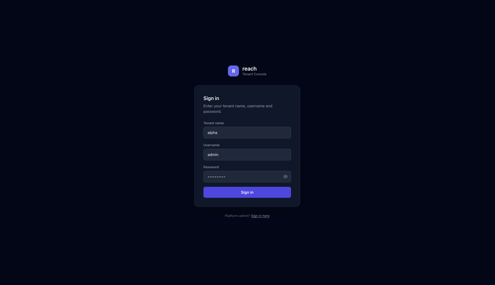
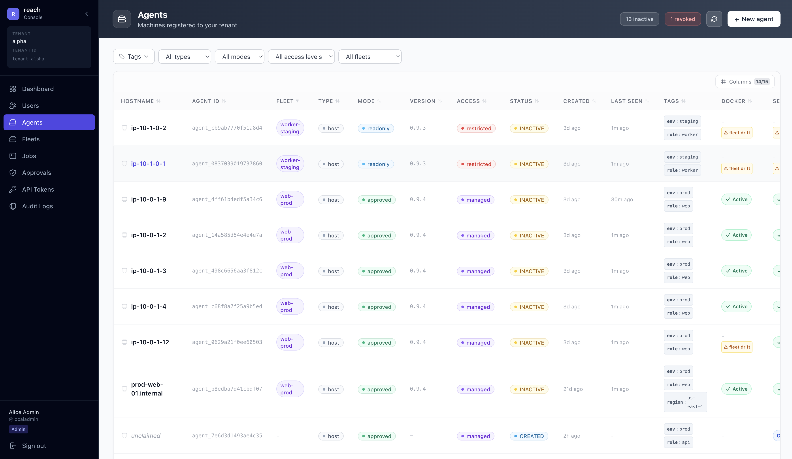
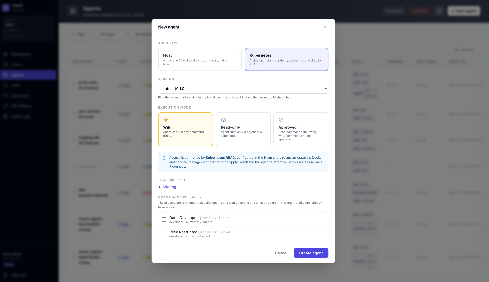
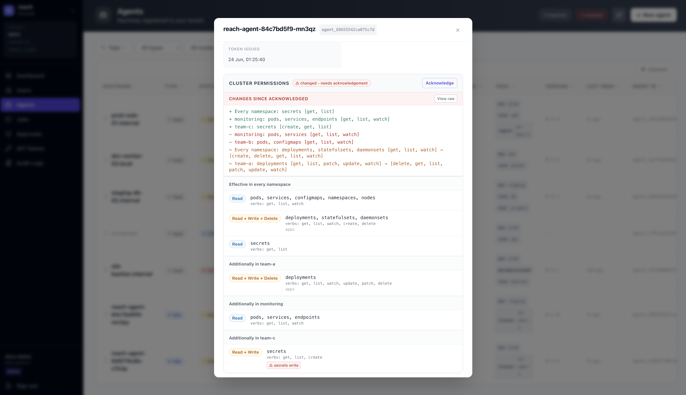
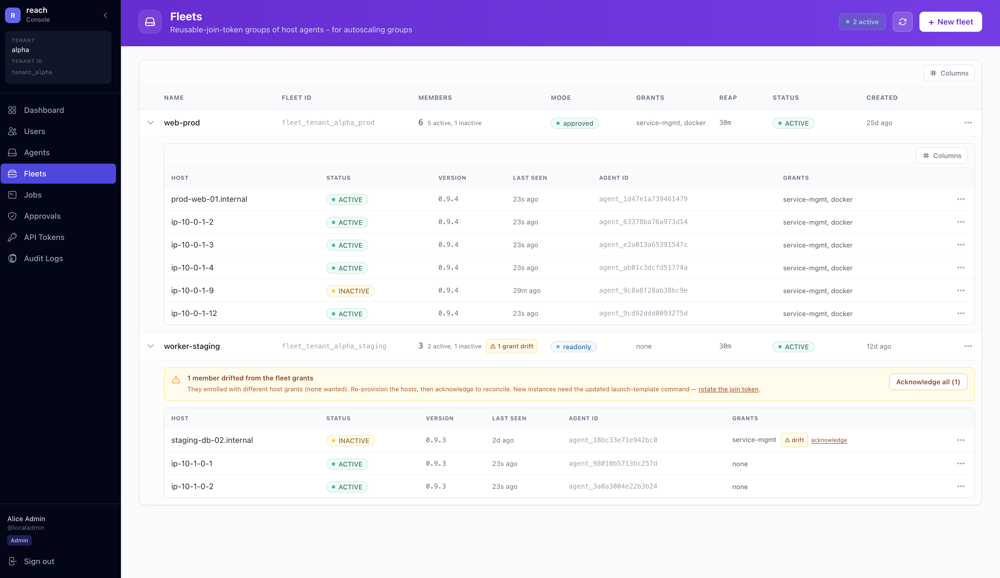
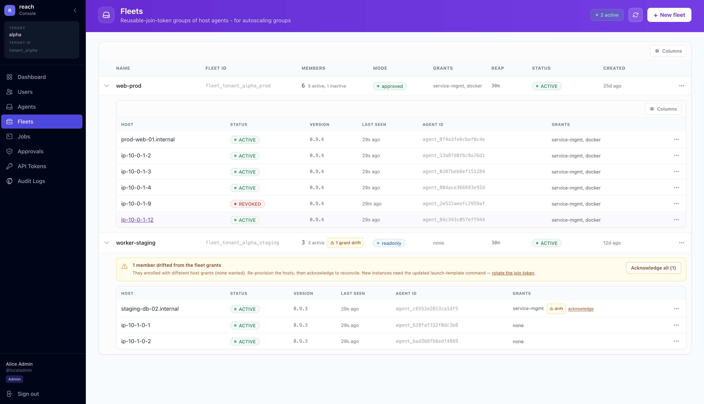

# reach

**Let AI agents operate your production machines - safely.** Reads run freely; every _write_ is **blocked and queued for a human to approve** before it touches anything. No SSH, no VPN, no open ports.

The one idea: on a production agent, an AI (or any automation) can look at everything, but it cannot change anything until a person approves the exact action.

```bash
# your agent asks to do something destructive on prod...
$ reach exec --agent prod -- kubectl delete pods --all -n payments
  Status: REJECTED - approval required; a request was sent to your operator.

# ...an operator approves the pending rule once - structured, not a string:
#   { verb: delete, resource: pods, namespace: payments, name: * }
$ reach approvals approve appr_9f2c
  Approved.

# ...and now it runs - this time and next, without re-asking.
$ reach exec --agent prod -- kubectl delete pods --all -n payments
  Status: SUCCEEDED
```

You approve a **rule**, not a command string - so an approved action can't be extended (`… | tee /etc/x`, `… && rm -rf`) to smuggle something past it. That's the difference between "AI on prod" being a liability and being something you can sleep next to.

## ⚡ 2-minute Quick Start

Zero to your **AI agent running commands on a real machine**, in three steps:

**1. Start Reach.** One command runs the backend, creates your tenant and first agent, installs the CLI, and logs you in:

```bash
curl -fsSL https://reach-releases.s3.amazonaws.com/local-setup.sh | bash
```

**2. Install the agent** on the machine you want to control. The script prints a ready-to-paste command - a `curl … | sudo bash` for a host, or `helm install …` for Kubernetes.

**3. Connect your AI tool.** `reach agent-init` writes the context file for Claude Code / Cursor and prints the MCP server config to drop in - now your agent can drive that machine through Reach:

```bash
reach agent-init
```

Now ask your AI agent to run something - or check it yourself:

```bash
reach exec -- hostname
```

That's it: your AI agent has **controlled, audited** access to the machine - no SSH, no VPN, no open ports. Setup **asks you to pick the mode** (`wild`/`readonly`/`approved`, default `wild` for a frictionless local try); when you point Reach at anything real, choose - or later switch to - **`approved` mode** (**Agents → [agent] → Policy**) so writes stop for sign-off - that's the posture up top. On AWS instead? Swap step 1 for `lambda-setup.sh`. Docker, Kubernetes, and production hardening are in [SELF_HOSTING.md](SELF_HOSTING.md).

---

> ### ⚠️ What Reach is - and isn't
>
> Reach gives AI agents **controlled, audited** command execution on machines you own. It is **not a sandbox for arbitrary untrusted commands.**
>
> - **On production, run `approved` mode** - the posture above: reads run, every write needs a human-approved structured rule, everything else is blocked and queued. This is the intended way to point an AI at real infrastructure.
> - **`wild` mode is the opt-in exception** - it runs anything (reboots, deletes, package installs). Use it only on personal/dev boxes where you're the sole user.
> - Reach is **not a security boundary against the machine's own owner/root** - whoever controls the host can read the agent's token.
>
> See **[SECURITY.md](SECURITY.md)** for the full threat model, and **[POLICIES.md](POLICIES.md)** for how the modes work.

---

## What can I use this for?

- **Give an AI agent standing access to production - safely** - lock agents to `approved` mode: reads run, every write waits for a human to approve the exact rule, everything is audited. The headline use case.
- **Run agent-driven operations you can trust** - restarts, scaling, rollouts, targeted deletes - each gated by a structured rule an operator approved once, not a command string that can be extended past the check.
- **Check Kubernetes pods from an in-cluster agent** - install the agent inside the cluster, run `kubectl` through it from your laptop; non-`kubectl` tools (helm, flux) are approvable the same way.
- **Let Claude Code inspect a remote dev box** - check what's running, tail logs, or diff configs without leaving your editor (reads never need approval).
- **Debug Docker containers without SSH** - `reach exec -- docker ps`, `docker logs`, `docker inspect` from anywhere.
- **Manage an autoscaling group as one fleet** - bake a fleet join token into your autoscaler's launch/instance template (AWS ASG, GCP MIG, Azure VMSS, …); instances auto-enroll on scale-out and clean themselves up on scale-in, inheriting the fleet's approved rules.

## Why Reach?

AI agents can reason about your infrastructure, but you can't hand one your production shell. The moment access is real, so is the risk: one confident-but-wrong `kubectl delete` or `rm -rf` and it's your outage.

Reach removes the all-or-nothing choice. An agent - Claude Code, Cursor, a custom LLM workflow, or your own automation - gets to **read everything and change nothing without sign-off**: every write stops at a human-approved structured rule, every action is audited, and it's all over outbound HTTPS (no SSH, VPNs, public IPs, or inbound firewall rules). You get the usefulness of an agent on prod without granting it a blank check.

## How it works

The agent never accepts inbound connections - it makes outbound HTTPS requests to your backend, polls for jobs, runs them, and posts results back.

1. Deploy the backend (Local, Lambda, or Docker).
2. Register agents in the console (or let the setup script do it) - you get ready-to-paste install commands.
3. Install the CLI locally and the agent on each machine.
4. Queue commands via the CLI or MCP; the agent picks them up and runs them; results come back.

The local and Lambda setup scripts do 1-3 for you. See [ARCHITECTURE.md](ARCHITECTURE.md) for the full design.

## Screenshots

<table>
  <tr>
    <td width="50%"><a href="docs/images/login.png"></a><br><b>Sign in</b> - tenant-scoped console login (tenant name, username, password); platform admins sign in separately.</td>
    <td width="50%"><a href="docs/images/agents.png"></a><br><b>Agents</b> - every host and Kubernetes agent in your tenant, with status, policy mode, and cluster-RBAC drift at a glance.</td>
  </tr>
  <tr>
    <td width="50%"><a href="docs/images/new-agent.png"></a><br><b>New agent</b> - enroll a host or Kubernetes agent: pick a version, execution mode, and access.</td>
    <td width="50%"><a href="docs/images/rbac-drift.png"></a><br><b>Cluster RBAC drift</b> - an agent's effective permissions diffed against the acknowledged baseline, down to the exact verbs.</td>
  </tr>
  <tr>
    <td width="50%"><a href="docs/images/fleets.png"></a><br><b>Fleets</b> - reusable-join-token groups of host agents (autoscaling groups). Members inherit the fleet's mode, tags, and grants; grant drift is flagged and reconciled per member or fleet-wide.</td>
    <td width="50%"><a href="docs/images/jobs.png"></a><br><b>Jobs</b> - command history across the fleet; writes in <code>approved</code> mode are gated (note the rejected <code>kubectl delete</code>).</td>
  </tr>
</table>

---

## Getting started

Reach is self-hosted: you deploy your own backend, then enroll machines as agents. The **interactive setup script** does the whole first run end to end - deploy the backend, provision your tenant, admin user, API token, and first agent, install the CLI, and log you in:

| Backend                             | Setup                                                                        |
| ----------------------------------- | ---------------------------------------------------------------------------- |
| **Local** (no cloud account)        | `curl -fsSL https://reach-releases.s3.amazonaws.com/local-setup.sh \| bash`  |
| **AWS Lambda + DynamoDB**           | `curl -fsSL https://reach-releases.s3.amazonaws.com/lambda-setup.sh \| bash` |
| **Docker + PostgreSQL** (any cloud) | `docker run … nabeemdev/reach:0.1.0`, then finish in the console at `/ui`    |

The Local and Lambda scripts are interactive, safe to re-run, and double as management tools (`--update`, `--down`, …). Full setup for all three - including the Docker environment variables - is in **[SELF_HOSTING.md](SELF_HOSTING.md)**.

**Install the CLI** (the setup script already does this):

```bash
uv tool install https://reach-releases.s3.amazonaws.com/cli/v0.1.0/reach-0.1.0-py3-none-any.whl
reach login --api-url "<your-api-url>" --api-key "<your-api-token>"   # token from the tenant console → API Tokens
```

Commands, profiles, aliases, and MCP setup: **[cli/README.md](cli/README.md)**.

### Add a machine

In the tenant console → **Agents → New agent**, pick the **type** (Host or Kubernetes) and a policy mode; the console prints the exact install command. For a whole autoscaling group of identical hosts, create a **Fleet** instead.

- **Host** - run the generated `curl … install.sh …` (auto-detects OS/arch: Linux → systemd service, macOS → foreground or LaunchDaemon). Optional `systemctl`/`docker` grants are set at install time.
- **Kubernetes** - run the generated `helm install …`; deploys **one logical agent per cluster** (a `Lease` elects the leader), bounded by cluster **RBAC** (default read-only `view`) which you acknowledge in the console - later changes surface as **drift**.
- **Fleet** - host-only (a cluster is already one agent). A **reusable join token** baked into your autoscaler's launch template: instances auto-enroll on scale-out, deregister on scale-in, and inherit the fleet's mode, tags, and grants.

Grant flags, full Helm values, RBAC, and fleet mechanics: **[SELF_HOSTING.md](SELF_HOSTING.md)** and **[agent/README.md](agent/README.md)**. Set an agent as your CLI default with `reach agents use <id|alias>`; decommission any from the console → **Agents**.

---

## Admin console

The backend ships a web UI at `/ui` with two consoles (choose at login):

- **Platform admin** (log in with `ADMIN_PASSWORD`) - cross-tenant administration: tenants, users across tenants, and platform-wide audit logs. It does **not** operate tenant agents or approvals.
- **Tenant console** (username + password) - per-tenant operations: dashboard, agents, fleets, users (roles + per-user read-only/read-write access to agents and fleets), jobs, approvals, API tokens, and a tenant-scoped audit log.

The CLI and MCP server authenticate with **API tokens** (created under **API Tokens**), not the admin password.

| Operation                                                      | Where                                                     |
| -------------------------------------------------------------- | --------------------------------------------------------- |
| View agents / job history                                      | Tenant console → Agents / Jobs                            |
| Change an agent's policy mode                                  | Tenant console → Agents → [agent] → Policy                |
| Manage approvals                                               | Tenant console → Approvals                                |
| Grant a user read-only / read-write access to agents or fleets | Tenant console → Users → [user] → Access                  |
| Audit log (tenant / platform)                                  | Tenant console → Audit Logs / Platform admin → Audit Logs |

Automating any of this? See [API.md](API.md).

---

## Using the CLI

```bash
reach agents list                           # your standalone machines, with mode + access level
reach exec -- <command>                     # run on the default machine
reach exec --agent <id|alias> -- <command>  # run on a specific machine
reach exec --tag env:prod -- <command>      # fan out to every standalone agent with a tag
reach exec --no-wait -- <command>           # fire-and-forget; check with `reach job <id>`
reach jobs                                  # recent jobs
reach fleets exec <fleet> -- <command>      # run on every member of a fleet
```

Aliases, multi-deployment profiles, fleets, approvals, `--json` output, and the full command reference are in **[cli/README.md](cli/README.md)**.

**AI agents & MCP.** `reach agent-init` writes context for Claude Code / Cursor and prints the MCP config so your AI tool can call Reach as tools. The MCP server (`reach mcp`) is launched by your MCP client - add `{"mcpServers":{"reach":{"command":"reach","args":["mcp"]}}}` to its settings. See [cli/README.md](cli/README.md#mcp-server).

---

## Policy modes

Each agent runs in one of three modes (set in the tenant console or via the API):

- **`approved`** ← the production mode - reads run; every write runs only if it matches a rule a human pre-approved for that agent, otherwise it's blocked and queued for review. This is the whole point of Reach.
- **`readonly`** - only reads run; any write/delete/restart/install is blocked. For a locked-down "look but don't touch" agent.
- **`wild`** - runs almost anything; only a catastrophic/abuse set (`rm -rf /`, `mkfs`, privileged escapes, reverse shells) is always blocked. For personal/dev boxes where you're the sole user.

Host and Kubernetes agents share these modes but enforce them differently - agent-side Landlock vs backend-side gating. Approvals are structured rules on both: host `{bin, args[]}` (positional `*`, trailing `...`), k8s `{verb, resource, namespace, name}`. Full detail (enforcement model, structured rules, `access_level`): **[POLICIES.md](POLICIES.md)**.

## Safety

Built for controlled execution: no inbound ports, no SSH, outbound-HTTPS-only agents, a default 60s command timeout, and a full audit trail.

- **Always blocked (any mode):** catastrophic filesystem destruction, fork bombs, privileged container/host escapes, credential exfiltration, and reverse shells - rejected server-side before the agent sees them.
- **Blocked in `readonly` / unapproved in `approved`:** writes, deletes, service restarts, package installs, container mutations, IaC/cloud destroys, privilege escalation.
- **Kubernetes agents** are bounded differently - no shell, a `kubectl` + read-filters allowlist, no local-file reads, backend verb-gating, and cluster RBAC as the unbypassable floor.

Blocked-command reference: [SELF_HOSTING.md](SELF_HOSTING.md). Threat model: [SECURITY.md](SECURITY.md). Policy detail: [POLICIES.md](POLICIES.md).

## Production usage

Use **`approved`** mode on production machines (set it when creating the agent, or under **Agents → [agent] → Policy**). `wild` is for personal machines, dev, and break-glass - not shared production.

## Observability

- **Audit log** (built-in) - every action recorded: logins, agent lifecycle (create/revoke/rotate/unreachable/recover/reap), fleet operations (create/rotate/revoke/detach), policy changes, approvals. Tenant-scoped or platform-wide, in the console or via the API (`GET /tenant/audit-logs`).
- **Prometheus metrics** (opt-in, Kubernetes agents) - `--set metrics.enabled=true` exposes `/metrics` (job/sync/blocked counters, leadership) with a `ServiceMonitor` and a `NetworkPolicy` locking the port to your Prometheus namespace. Off by default. See [agent/README.md → Metrics](agent/README.md#metrics-opt-in).

---

## Documentation

| Doc                                                | What's in it                                                                                                                                    |
| -------------------------------------------------- | ----------------------------------------------------------------------------------------------------------------------------------------------- |
| [cli/README.md](cli/README.md)                     | The `reach` CLI and `reach-mcp` server - install, commands, profiles, aliases, MCP setup                                                        |
| [POLICIES.md](POLICIES.md)                         | Policy modes (approved/readonly/wild), approvals, host vs Kubernetes enforcement, structured host & k8s rules, `access_level`                   |
| [agent/README.md](agent/README.md)                 | How the agent works - host vs Kubernetes, credential-only identity, the poll loop, execution models, leader election, RBAC self-review, metrics |
| [deploy/helm/reach-agent](deploy/helm/reach-agent) | Kubernetes agent Helm chart - install, RBAC (`clusterAccess`), execution allowlist, and all values                                              |
| [SELF_HOSTING.md](SELF_HOSTING.md)                 | Deploy and operate your own backend (Local, AWS Lambda, Docker), setup, agent lifecycle, grants, blocked-command reference                      |
| [API.md](API.md)                                   | Complete HTTP endpoint reference, rate limits, pagination, audit-log actions                                                                    |
| [ARCHITECTURE.md](ARCHITECTURE.md)                 | How the pieces fit - command flow, token model, storage split, policy enforcement, approvals, fleets, multi-tenancy                             |
| [SECURITY.md](SECURITY.md)                         | Threat model, token storage and rotation, revoking access, audit history, production hardening                                                  |

---

## License

MIT - see [LICENSE](LICENSE).
